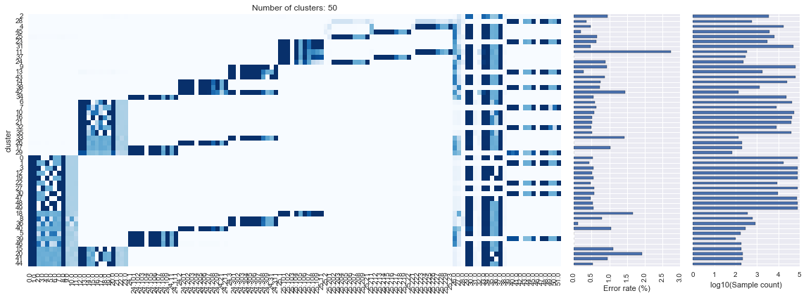
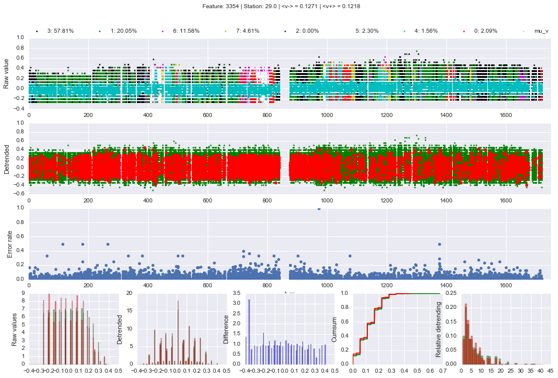
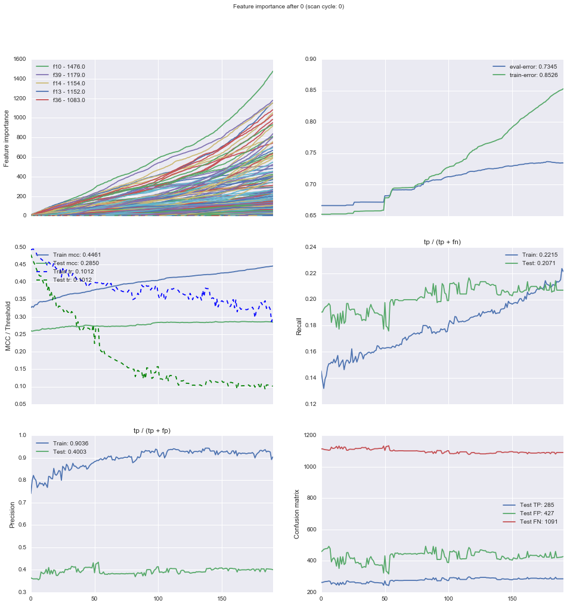
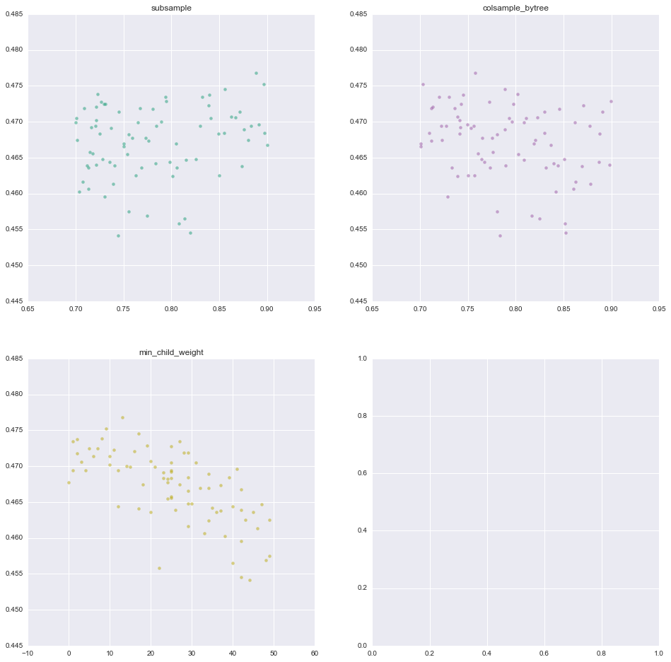

# Kaggle (Bosch, leaderboard 8 / 1373)
This repo contains a collection of Python / R script used for the [Bosch Production Line Performance prediction Kaggle competition](https://www.kaggle.com/c/bosch-production-line-performance). This code was used to achieve a nr. 8 position on the leaderboard with a [MCC](https://www.kaggle.com/c/bosch-production-line-performance/details/evaluation) score of 0.50888. More details about the end-to-end approach can be found [here](https://www.kaggle.com/c/bosch-production-line-performance/forums/t/25382/8th-place-solution-team-lajmburo). This code does not run end-to-end and is sparsely documented, but people might be interested in parts of the feature engineering, visualization or modeling code. Below a short overview of our approach and links to the related notebooks. Feel free to ask for clarification.

## Prerequisites
It requires the usual Python packages: Pandas, Numpy, Seaborn, Scipy and Matplotlib. For modeling Sklearn, XGBoost and LightGBM are required. The datasets can be downloaded [here](https://www.kaggle.com/c/bosch-production-line-performance/data). Memory requirement is at least 16GB.

## Preprocessing
After downloading the datasets from Kaggle, the following preprocessing steps are required:
- Conversion of data from dense format to sparse. Sparsity is around 80% on average, so this allows much faster feature generation with a smaller memory footprint. [Script](pre_convert_data_to_sparse.ipynb)
- Creating a look-up-table that helps merging data between the numeric, categorical and timestamp datasets. [Step1](pre_create_lookup_table.ipynb), [Step2](pre_create_lookup_table_lines_V2.ipynb)
- Clustering all samples based on the path they traversed through the manufacturing lines. Notebook to create paths [here](pre_path_per_sample.ipynb) and and clustering notebook [here](pre_kmeans_cluster.ipynb). Example result below.

## Feature engineering
### Order:
- [Correlation with next/previous samples after sorting by tmax, tmin](feature_set_magic.ipynb)
- [Correlation with next/previous samples after sorting by numerical values](feature_set_lead_lag_numeric.ipynb)
- [Same timestamps previous/next sample after sorting by tmax](feature_set_same_line.ipynb)
- Previous / next response for duplicates

### Path:
- [Cluster of samples by path and calculated per sample the absolute and relative difference between numeric / time difference (max - min) features and cluster mean.](feature_set_path.ipynb)
- [Path based error rate (leave one out method) but it did not improve score](feat_randomized_loo_time_path.ipynb)
- Entry / exit station
- [Previous and next station for S29 - S37 (one-hot encoded)](feature_set_source_dest_stations.ipynb)

### Datetime:
- [Timestamp per station, per line, merged per path](feature_set_date.ipynb)
- [Max-min per station, per line, merged per path](feature_set_date.ipynb)
- [Kurtosis + kurtosis per line (very strong, surprisingly)](feature_set_timestamp.ipynb)
- Lead/lag response rate statistics after sorting by tmax, id
- Lead/lag response rate statistics after sorting by tmax, numeric, id
- [Timestamp based error rate (leave one out method) but it did not improve score](feat_randomized_loo_time_path.ipynb)
- Timestamp label-based density (overfit)

### Numeric:
- Use supervised decision trees to try to predict the numeric value using the date, per station => the split points allow to define thresholds, which clustered the values by group of dates (over 4000 features) => used xgboost per station to shrink it to ~120 features as adding 4000 features didn’t help at all
- [Numeric after removing time trend (did not improve score)](feature_set_numeric_detrended.ipynb)
- [Deviation from mean summed over station/line](feature_set_numeric.ipynb)
- Raw numeric data (a specific selection of them)

Below image of dashboards used to evaluate numeric features.

### Categorical:
- [Couple of features one-hot encoded](feature_set_categorical.ipynb) added a little bit

## Modelling scripts.

### Level one models:
- Data set 1 (0.477 gbm): order, raw numeric, date, categorical
- Data set 2 (0.482 gbm, 0.477 xgb, 0.473 rf): order, path, raw numeric, date
- Data set 3 (0.479 gbm, 0.473 xgb): order, path, numeric, date, refined categorical
- Data set 4 (0.469 xgb, 0.442 rf): 
- Data set 5 (0.43 xgb): has faron’s magic features, path, unsupervised nearest neighbors
    
### Level 2 stack models 
Giving the weaker model a stronger weight was better:
- 30% weighted xgboost gbtree (~0.488 CV)
- 70% weighted Random Forest (~0.485 CV)

Typical training dashboard:

### Hyperparameter optimization using HyperOpt
- HyperOpt was used to do Bayesian optimization of hyperparameters. Script for [XGBoost model](model_hyperopt.ipynb) and [RandomForest](model_hyperopt-stacker.ipynb). Below example output

### Analysis of submission files
- [This notebook](model_submission_analysis.ipynb) was used to evaluate and compare different lvl one models.
